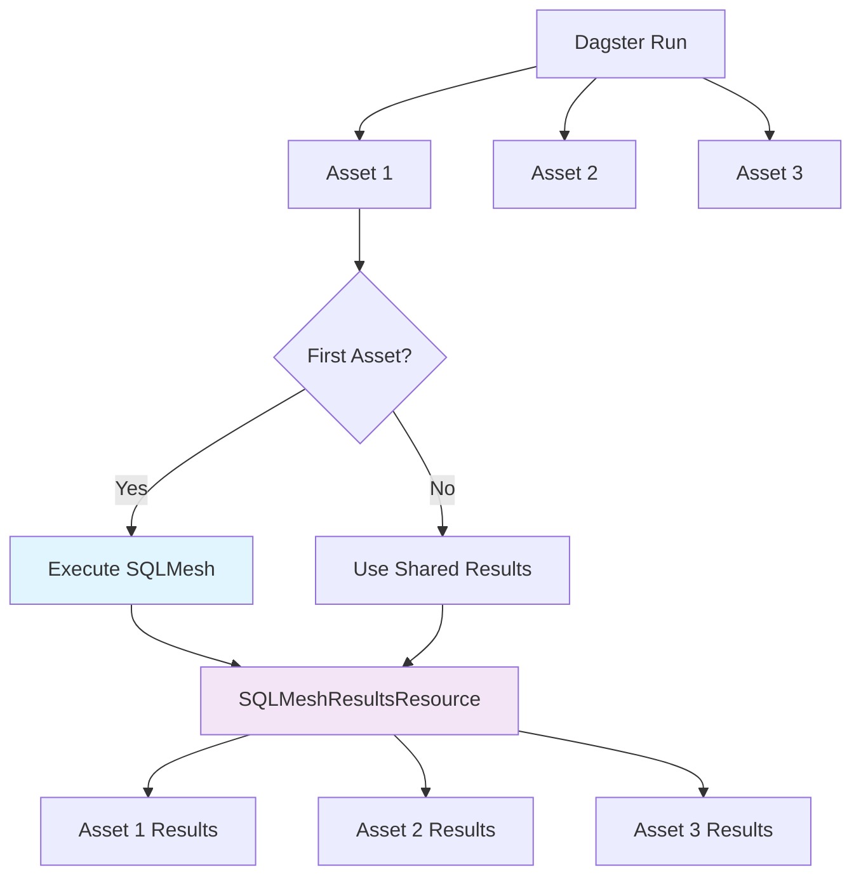

# ADR-0002: Shared SQLMesh Execution per Dagster Run

## Status

**Accepted** - 2025-08-05

## Context

With individual assets, each asset could potentially trigger its own SQLMesh execution. This would:
1. **Bypass SQLMesh's natural dependency management** (skipping downstream models on upstream failure)
2. **Create multiple SQLMesh runs** for the same logical operation
3. **Lose SQLMesh's atomic execution benefits**

## Decision

**Use a single SQLMesh execution per Dagster run, shared between all selected assets.**

## Rationale

### Problems with Multiple SQLMesh Executions

1. **Lost Dependency Management**: SQLMesh naturally skips downstream models when upstream fails
2. **Multiple Runs**: Each asset triggers its own `sqlmesh run` command
3. **Inconsistent State**: Different assets might see different SQLMesh states
4. **Performance Overhead**: Multiple SQLMesh context initializations

### Benefits of Shared Execution

1. **Respects SQLMesh Dependencies**: Natural upstream/downstream skipping
2. **Single Execution**: One `sqlmesh run` per Dagster run
3. **Consistent State**: All assets see the same SQLMesh execution results
4. **Better Performance**: Single SQLMesh context and execution

## Implementation

### SQLMeshResultsResource

```python
class SQLMeshResultsResource(ConfigurableResource):
    """Resource pour partager les résultats SQLMesh entre les assets d'un même run."""
    
    def store_results(self, run_id: str, results: Dict[str, Any]) -> None:
        """Stocke les résultats SQLMesh pour un run donné."""
        self._results[run_id] = results
    
    def get_results(self, run_id: str) -> Optional[Dict[str, Any]]:
        """Récupère les résultats SQLMesh pour un run donné."""
        return self._results.get(run_id)
```

### Asset Execution Logic

```python
def model_asset(context: AssetExecutionContext, sqlmesh: SQLMeshResource, sqlmesh_results: SQLMeshResultsResource):
    # Check if SQLMesh already executed for this run
    if not sqlmesh_results.has_results(context.run_id):
        # First asset in run - execute SQLMesh for all selected assets
        selected_asset_keys = context.selected_asset_keys
        models_to_materialize = get_models_to_materialize(selected_asset_keys, ...)
        plan = sqlmesh.materialize_assets_threaded(models_to_materialize)
        
        # Store results for other assets in this run
        results = {
            "failed_check_results": sqlmesh._process_failed_models_events(),
            "skipped_models_events": sqlmesh._console.get_skipped_models_events(),
            "evaluation_events": sqlmesh._console.get_evaluation_events(),
        }
        sqlmesh_results.store_results(context.run_id, results)
    else:
        # Use existing results from this run
        results = sqlmesh_results.get_results(context.run_id)
```

## Architecture Diagram



## Consequences

### Positive

- ✅ **Respects SQLMesh dependencies** - Natural upstream/downstream skipping
- ✅ **Single execution** - One SQLMesh run per Dagster run
- ✅ **Consistent state** - All assets see same results
- ✅ **Better performance** - No multiple SQLMesh initializations
- ✅ **Proper error propagation** - Upstream failures correctly affect downstream

### Negative

- ⚠️ **Complex resource management** - Need SQLMeshResultsResource
- ⚠️ **Shared state complexity** - Results must be thread-safe
- ⚠️ **Debugging complexity** - Harder to trace individual asset execution

## Related Decisions

- [ADR-0001: Individual Assets vs Multi-Asset Pattern](./0001-individual-assets-vs-multi-asset.md)
- [ADR-0003: Asset Check Integration](./0003-asset-check-integration.md) 