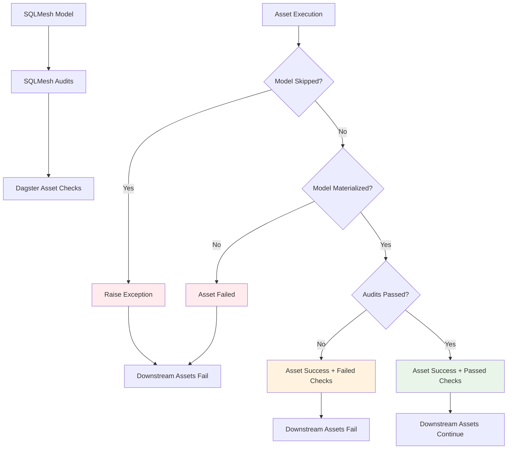

# ADR-0003: Asset Check Integration for SQLMesh Audits

## Status

**Accepted** - 2025-08-05

## Context

SQLMesh models can have audits that validate data quality. These audits need to be exposed in Dagster's UI as asset checks. The challenge is to distinguish between:
1. **Materialization failures** (model didn't execute)
2. **Audit failures** (model executed but audits failed)

## Decision

**Use Dagster AssetCheckResult to represent SQLMesh audits, with proper failure handling.**

## Rationale

### Materialization vs Audit Failure

SQLMesh distinguishes between:
- **Model execution failure**: Model didn't materialize (upstream failure, syntax error, etc.)
- **Audit failure**: Model materialized successfully but audits failed

### Dagster Integration Strategy

1. **Materialization Success + Audit Failure**: Asset materializes (green) but shows failed checks
2. **Materialization Failure**: Asset fails (red) and downstream assets fail
3. **Audit Success**: Asset materializes (green) with passed checks

## Implementation

### Asset Check Creation

```python
# Create asset checks from SQLMesh audits
model_checks = create_asset_checks_from_model(model, asset_key)

@asset(
    check_specs=model_checks,  # Dagster asset checks
    # ... other parameters
)
def model_asset():
    # ... execution logic
```

### Failure Handling Logic

```python
# Check if model was skipped due to upstream failure
if model_was_skipped:
    raise Exception(f"Model {model_name} was skipped due to upstream failures")

# Check if model materialized but audits failed
elif model_has_audit_failures:
    # Asset materializes successfully but with failed checks
    return MaterializeResult(
        asset_key=asset_key,
        check_results=[
            AssetCheckResult(
                check_name=check.name,
                passed=False,
                metadata={
                    "audit_message": audit_message,
                    "sqlmesh_audit_name": check.name,
                    "error_details": f"SQLMesh audit '{check.name}' failed: {audit_message}"
                }
            )
            for check in model_checks
        ]
    )
else:
    # Full success - materialization and audits passed
    return MaterializeResult(
        asset_key=asset_key,
        check_results=[
            AssetCheckResult(
                check_name=check.name,
                passed=True
            )
            for check in model_checks
        ]
    )
```

## Architecture Diagram



## Consequences

### Positive

- ✅ **Proper failure distinction** - Materialization vs audit failures
- ✅ **Dagster UI integration** - Asset checks visible in UI
- ✅ **Downstream failure propagation** - Failed audits affect downstream
- ✅ **Detailed error messages** - Audit failure details in metadata
- ✅ **Non-blocking checks** - Assets can succeed with failed checks

### Negative

- ⚠️ **Complex failure logic** - Need to distinguish failure types
- ⚠️ **SQLMesh audit limitations** - Only supports blocking audits currently
- ⚠️ **UI complexity** - Users must understand asset vs check status

## Current Limitations

### Non-Blocking Audits

**SQLMesh supports non-blocking audits, but current implementation only handles blocking audits.**

```sql
-- SQLMesh non-blocking audit (not yet supported)
MODEL (
    name my_model,
    audits [
        UNIQUE_VALUES(columns=[id]) -- blocking
        UNIQUE_VALUES(columns=[email]) -- non-blocking
    ]
)
```

**Future enhancement needed to support non-blocking audits.**

## Related Decisions

- [ADR-0001: Individual Assets vs Multi-Asset Pattern](./0001-individual-assets-vs-multi-asset.md)
- [ADR-0002: Shared SQLMesh Execution](./0002-shared-sqlmesh-execution.md)
- [ADR-0004: Retry Policy Management](./0004-retry-policy-management.md) 