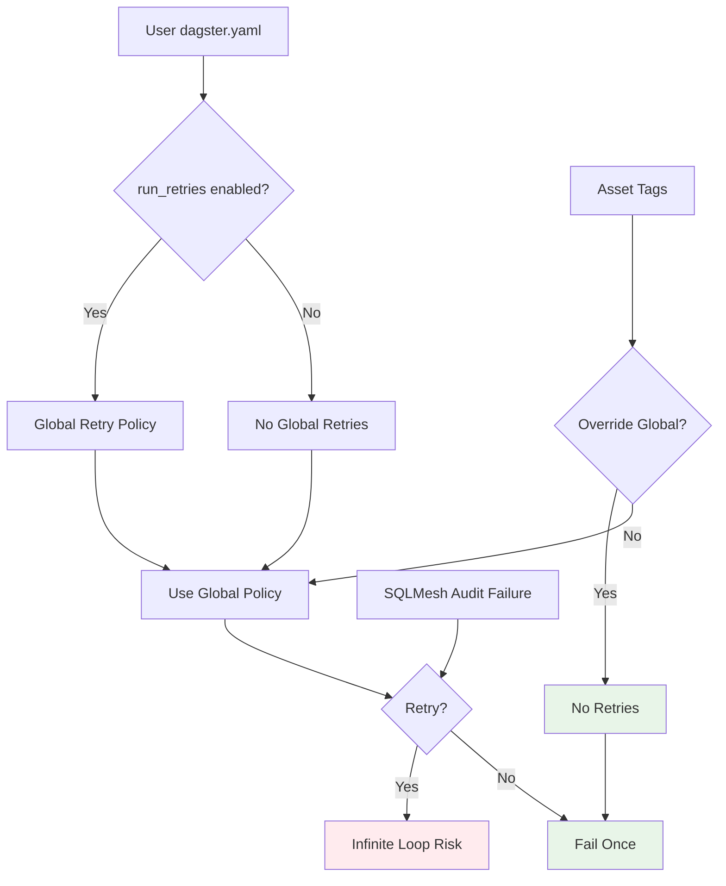

# ADR-0004: Retry Policy Management for SQLMesh Integration

## Status

**Accepted** - 2025-08-05

## Context

SQLMesh audit failures can be persistent (e.g., data quality issues that don't resolve automatically). When Dagster retries failed assets, this can create infinite retry loops if the underlying SQLMesh audit continues to fail.

## Decision

**Force `run_retries=false` via Dagster tags instead of global configuration.**

## Rationale

### Problems with Global Retry Configuration

1. **User Configuration Dependency**: Users might enable `run_retries` in their `dagster.yaml`
2. **Infinite Loops**: Persistent SQLMesh audit failures trigger endless retries
3. **Resource Waste**: Unnecessary CPU/memory usage from repeated failed executions
4. **UI Confusion**: Multiple failed runs clutter the Dagster UI

### Benefits of Tag-Based Retry Control

1. **Module-Level Control**: `dg-sqlmesh` controls retry behavior regardless of user configuration
2. **Prevents Infinite Loops**: No retries on persistent SQLMesh audit failures
3. **User-Friendly**: Works regardless of user's global Dagster configuration
4. **Explicit Intent**: Clear that SQLMesh assets should not retry on audit failures

## Implementation

### Asset-Level Tags

```python
@asset(
    # ... other parameters
    tags={
        **(current_asset_spec.tags or {}),
        "dagster/max_retries": "0",
        "dagster/retry_on_asset_or_op_failure": "false"
    },
)
def model_asset():
    # ... execution logic
```

### Job-Level Tags

```python
sqlmesh_job = define_asset_job(
    name="sqlmesh_job",
    selection=sqlmesh_assets,
    tags={
        "dagster/max_retries": "0",
        "dagster/retry_on_asset_or_op_failure": "false"
    }
)
```

## Architecture Diagram



## Consequences

### Positive

- ✅ **Prevents infinite loops** - No retries on persistent SQLMesh audit failures
- ✅ **Module-level control** - Works regardless of user configuration
- ✅ **Resource efficient** - No wasted CPU/memory on failed retries
- ✅ **Clear UI** - Single failed run instead of multiple retries
- ✅ **User-friendly** - No dependency on user's `dagster.yaml` configuration

### Negative

- ⚠️ **Less resilient** - No automatic retry on transient failures
- ⚠️ **Manual intervention** - Users must manually retry on transient issues
- ⚠️ **Tag complexity** - Need to maintain retry tags on all assets/jobs

## Alternative Approaches Considered

### 1. Global Configuration Only

```yaml
# dagster.yaml
run_retries:
  enabled: false
```

**Rejected**: Users might override this setting.

### 2. Conditional Retry Logic

```python
# Only retry on certain error types
if isinstance(error, TransientError):
    # Allow retry
else:
    # No retry
```

**Rejected**: Too complex to distinguish error types reliably.

### 3. RetryPolicy with Limited Attempts

```python
@asset(retry_policy=RetryPolicy(max_attempts=1))
```

**Rejected**: Still allows one retry, which can be problematic for persistent failures.

## Related Decisions

- [ADR-0001: Individual Assets vs Multi-Asset Pattern](./0001-individual-assets-vs-multi-asset.md)
- [ADR-0002: Shared SQLMesh Execution](./0002-shared-sqlmesh-execution.md)
- [ADR-0003: Asset Check Integration](./0003-asset-check-integration.md) 