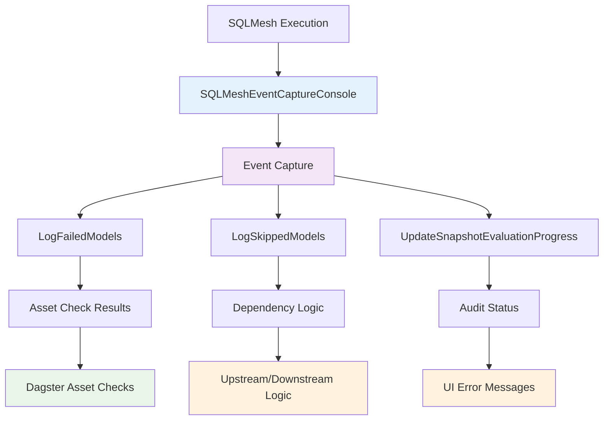
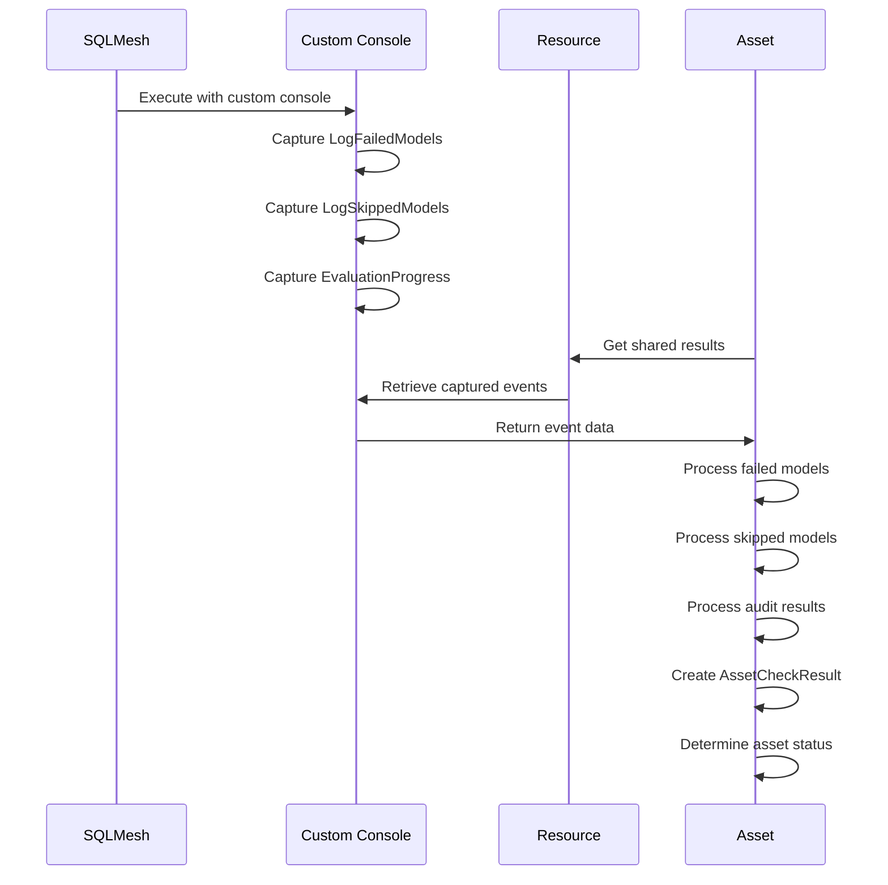

# ADR-0005: Custom SQLMesh Console for Event Capture

## Status

**Accepted** - 2025-08-05

## Context

SQLMesh provides a console system for capturing execution events (audits, failures, skips, etc.). We need to capture these events to:
1. **Determine asset success/failure status**
2. **Extract audit results for Dagster asset checks**
3. **Handle upstream/downstream dependency logic**
4. **Provide detailed error messages in Dagster UI**

## Decision

**Use a custom SQLMesh console (`SQLMeshEventCaptureConsole`) to capture and process SQLMesh events.**

## Rationale

### Problems with Default SQLMesh Console

1. **No Event Capture**: Default console doesn't capture events for later processing
2. **No Structured Data**: Events are logged but not available programmatically
3. **No Dagster Integration**: No way to convert SQLMesh events to Dagster concepts
4. **Limited Error Context**: Missing detailed error information for UI display

### Benefits of Custom Console

1. **Event Capture**: Captures all SQLMesh events for processing
2. **Structured Data**: Events available as structured data for asset logic
3. **Dagster Integration**: Converts SQLMesh events to Dagster asset checks
4. **Detailed Error Context**: Rich error information for UI display

## Implementation

### Event Types Captured

```python
@dataclass(kw_only=True)
class LogFailedModels(BaseConsoleEvent):
    errors: list[t.Any]  # NodeExecutionFailedError

@dataclass(kw_only=True)
class LogSkippedModels(BaseConsoleEvent):
    snapshot_names: set[str]

@dataclass(kw_only=True)
class UpdateSnapshotEvaluationProgress(BaseConsoleEvent):
    snapshot: Snapshot
    batch_idx: int
    duration_ms: int | None
    num_audits_passed: int | None = None
    num_audits_failed: int | None = None
```

### Console Integration

```python
class SQLMeshEventCaptureConsole(IntrospectingConsole):
    def __init__(self, translator=None, **kwargs):
        super().__init__(**kwargs)
        self.translator = translator
        self.failed_models_events = []
        self.skipped_models_events = []
        self.evaluation_events = []
        self.plan_events = []
    
    def _handle_log_failed_models(self, event: LogFailedModels) -> None:
        """Capture failed model events for asset check creation."""
        self.failed_models_events.append(event)
    
    def _handle_log_skipped_models(self, event: LogSkippedModels) -> None:
        """Capture skipped model events for dependency logic."""
        self.skipped_models_events.append(event)
    
    def _handle_update_snapshot_evaluation(self, event: UpdateSnapshotEvaluationProgress) -> None:
        """Capture evaluation progress for audit results."""
        self.evaluation_events.append(event)
```

## Architecture Diagram



## Event Processing Flow



## Consequences

### Positive

- ✅ **Complete event capture** - All SQLMesh events available for processing
- ✅ **Structured data** - Events as structured objects, not just logs
- ✅ **Dagster integration** - Events converted to Dagster concepts
- ✅ **Detailed error context** - Rich error information for UI
- ✅ **Dependency logic** - Proper upstream/downstream handling

### Negative

- ⚠️ **Complex event handling** - Need to handle all SQLMesh event types
- ⚠️ **Memory usage** - Events stored in memory during execution
- ⚠️ **Event parsing complexity** - Need to parse SQLMesh event structures
- ⚠️ **Console maintenance** - Custom console needs updates with SQLMesh changes

## Event Types and Usage

| Event Type | Purpose | Dagster Usage |
|------------|---------|---------------|
| `LogFailedModels` | Capture model execution failures | Create failed asset checks |
| `LogSkippedModels` | Capture upstream dependency skips | Determine asset skip status |
| `UpdateSnapshotEvaluationProgress` | Capture audit results | Create asset check results |
| `StartSnapshotEvaluationProgress` | Track model execution | Monitor execution progress |
| `StopEvaluationProgress` | Determine execution success | Set asset materialization status |

## Related Decisions

- [ADR-0002: Shared SQLMesh Execution](./0002-shared-sqlmesh-execution.md)
- [ADR-0003: Asset Check Integration](./0003-asset-check-integration.md) 