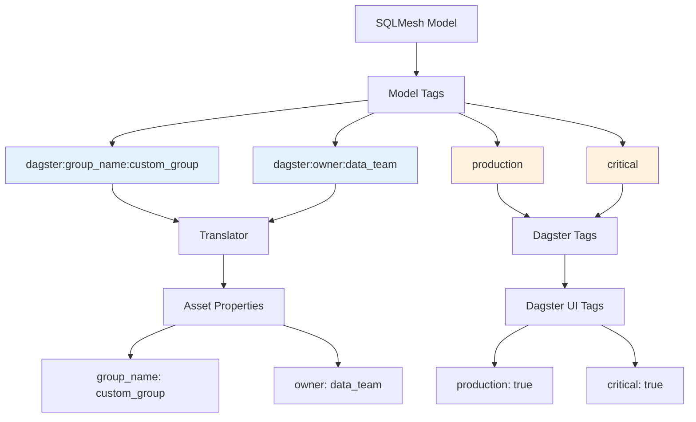

# ADR-0006: SQLMesh to Dagster Tag Convention

## Status

**Accepted** - 2025-08-05

## Context

SQLMesh models can have tags that provide metadata about the model. We need a way to pass SQLMesh model properties to Dagster assets (group names, owners, etc.) while maintaining separation between SQLMesh configuration and Dagster presentation.

## Decision

**Use the `dagster:property_name:value` tag convention to pass SQLMesh model properties to Dagster assets.**

## Rationale

### Problems with Direct Property Mapping

1. **No Separation**: SQLMesh model properties directly mapped to Dagster properties
2. **No Flexibility**: Cannot override Dagster properties without changing SQLMesh model
3. **No Extensibility**: Hard to add new Dagster properties without code changes
4. **No Filtering**: All SQLMesh tags would appear in Dagster UI

### Benefits of Tag Convention

1. **Clear Separation**: SQLMesh configuration vs Dagster presentation
2. **Flexible Override**: Can override Dagster properties via tags
3. **Extensible**: Easy to add new Dagster properties via tags
4. **Filtered Display**: Only non-Dagster tags appear in Dagster UI

## Implementation

### Tag Convention

```sql
-- SQLMesh model with Dagster properties
MODEL (
    name my_model,
    tags [
        "dagster:group_name:custom_group",
        "dagster:owner:data_team",
        "dagster:description:Custom model description",
        "production",  -- Regular SQLMesh tag
        "critical"     -- Regular SQLMesh tag
    ]
)
```

### Translator Implementation

```python
def _get_dagster_property_from_tags(self, model, property_name: str) -> Optional[str]:
    """
    Parse SQLMesh tags to extract Dagster properties.
    Convention: "dagster:property_name:value"
    """
    tags = getattr(model, "tags", set())

    for tag in tags:
        if tag.startswith("dagster:"):
            parts = tag.split(":")
            if len(parts) >= 3 and parts[1] == property_name:
                return parts[2]

    return None

def get_group_name_with_fallback(self, context, model, factory_group_name: str) -> str:
    """
    Determines group_name with fallback to factory.
    Priority: tag > factory > default fallback
    """
    # Check SQLMesh tags for Dagster properties
    dagster_property = self._get_dagster_property_from_tags(model, "group_name")
    if dagster_property:
        return dagster_property

    # If no tag, use factory value
    if factory_group_name:
        return factory_group_name

    # Fallback: default logic
    path = self.get_asset_key_name(getattr(model, "fqn", getattr(model, "view_name", "")))
    return path[-2] if len(path) >= 2 else "default"
```

### Tag Filtering

```python
def get_tags(self, context, model) -> dict:
    """Returns model tags as dict."""
    tags = getattr(model, "tags", set())

    # Filter Dagster configuration tags
    dagster_tags = {}
    for tag in tags:
        # Ignore tags starting with "dagster:" (internal configuration)
        if not tag.startswith("dagster:"):
            dagster_tags[tag] = "true"

    return dagster_tags
```

## Architecture Diagram



## Supported Properties

| Property      | Purpose             | Example                            |
| ------------- | ------------------- | ---------------------------------- |
| `group_name`  | Dagster asset group | `dagster:group_name:staging`       |
| `owner`       | Asset owner         | `dagster:owner:data_team`          |
| `description` | Asset description   | `dagster:description:Custom model` |
| `team`        | Team ownership      | `dagster:team:analytics`           |
| `priority`    | Asset priority      | `dagster:priority:high`            |

## Priority Chain

For each Dagster property, the following priority is used:

1. **SQLMesh tag** (`dagster:property_name:value`) - Highest priority
2. **Factory parameter** (e.g., `group_name` in factory call) - Medium priority
3. **Default logic** (e.g., schema name for group) - Lowest priority

## Examples

### Basic Model

```sql
MODEL (
    name customers,
    tags ["dagster:group_name:marts"]
)
```

**Result**: Asset group = `marts`

### Model with Multiple Properties

```sql
MODEL (
    name orders,
    tags [
        "dagster:group_name:marts",
        "dagster:owner:analytics_team",
        "dagster:description:Customer orders with line items",
        "production",
        "dagster:priority:high"
    ]
)
```

**Result**:

- Asset group = `marts`
- Asset owner = `analytics_team`
- Asset description = `Customer orders with line items`
- Dagster UI tags = `production: true`, `priority: high`

### Model without Dagster Tags

```sql
MODEL (
    name raw_data,
    tags ["staging", "test"]
)
```

**Result**: Uses factory defaults or fallback logic

## Consequences

### Positive

- ✅ **Clear separation** - SQLMesh configuration vs Dagster presentation
- ✅ **Flexible override** - Can override any Dagster property via tags
- ✅ **Extensible** - Easy to add new Dagster properties
- ✅ **Filtered display** - Only relevant tags appear in Dagster UI
- ✅ **Backward compatible** - Works with existing SQLMesh models
- ✅ **Priority chain** - Clear precedence for property resolution

### Negative

- ⚠️ **Tag complexity** - Users must understand the convention
- ⚠️ **String parsing** - Need to parse tag strings in translator
- ⚠️ **Validation** - No validation of tag format
- ⚠️ **Documentation** - Users need to know supported properties

## Related Decisions

- [ADR-0001: Individual Assets vs Multi-Asset Pattern](./0001-individual-assets-vs-multi-asset.md)
- [ADR-0005: Custom SQLMesh Console for Event Capture](./0005-custom-sqlmesh-console.md)
