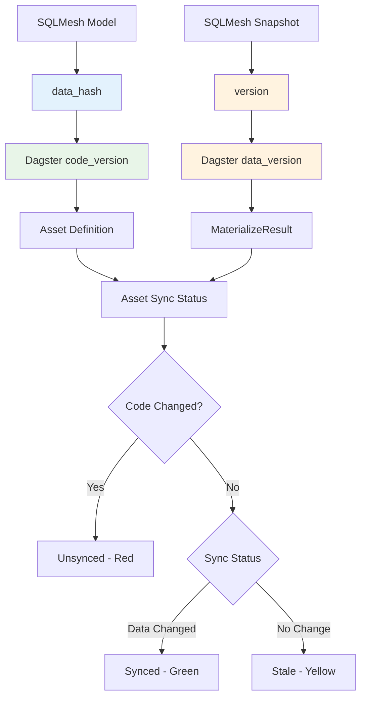

# ADR-0007: Code Version and Data Version Mapping

## Status

**Accepted** - 2025-08-05

## Context

Dagster uses `code_version` and `data_version` to determine asset synchronization status. SQLMesh has its own versioning system with `data_hash` and snapshot versions. We need to map these concepts correctly to ensure Dagster assets show proper sync status and avoid unnecessary re-materializations.

## Decision

**Map SQLMesh `data_hash` to Dagster `code_version` and SQLMesh snapshot version to Dagster `data_version`.**

## Rationale

### Dagster Version Concepts

- **`code_version`**: Represents the version of the asset's code/logic
- **`data_version`**: Represents the version of the actual data in the asset

### SQLMesh Version Concepts

- **`data_hash`**: Hash of the model's SQL code and dependencies (changes when code changes)
- **Snapshot version**: Unique identifier for each materialization (changes when data changes)

### Mapping Strategy

1. **`code_version` ← `data_hash`**: When SQL code changes, `data_hash` changes
2. **`data_version` ← Snapshot version**: When data is materialized, snapshot version changes

## Implementation

### Asset Definition (Code Version)

```python
# Extract code_version from SQLMesh model's data_hash
code_version = str(getattr(model, "data_hash", "")) if hasattr(model, "data_hash") and getattr(model, "data_hash") else None

# Use in AssetSpec
spec = AssetSpec(
    key=asset_key,
    code_version=code_version,  # ← SQLMesh data_hash
    # ... other properties
)
```

### Materialization (Data Version)

```python
# Extract data_version from SQLMesh snapshot version
snapshot = assetkey_to_snapshot.get(asset_key)
if snapshot:
    snapshot_version = getattr(snapshot, "version", None)

    yield MaterializeResult(
        asset_key=asset_key,
        data_version=DataVersion(str(snapshot_version)) if snapshot_version else None,  # ← SQLMesh snapshot version
        # ... other properties
    )
```

## Architecture Diagram



## Version Change Scenarios

### 1. Code Change (SQL Modified)

```sql
-- Before
SELECT id, name FROM customers

-- After
SELECT id, name, email FROM customers  -- ← Code changed
```

**Result:**

- SQLMesh `data_hash` changes
- Dagster `code_version` changes
- Asset shows as **"Unsynced"** (red)
- Requires re-materialization

### 2. Data Change (New Data Available)

```sql
-- Same SQL code, but new data in source
SELECT id, name FROM customers  -- ← New records available
```

**Result:**

- SQLMesh `data_hash` unchanged
- SQLMesh snapshot version changes
- Dagster `data_version` changes
- Asset shows as **"Synced"** (green)

### 3. No Change

```sql
-- Same SQL code, no new data
SELECT id, name FROM customers  -- ← No changes
```

**Result:**

- SQLMesh `data_hash` unchanged
- SQLMesh snapshot version unchanged
- Dagster versions unchanged
- Asset shows as **"Stale"** (yellow) or **"Synced"** (green)

## Consequences

### Positive

- ✅ **Accurate sync status** - Dagster UI shows correct asset status
- ✅ **Efficient re-materialization** - Only re-materialize when code actually changes
- ✅ **Proper dependency tracking** - Dagster understands when upstream code changes
- ✅ **SQLMesh integration** - Uses SQLMesh's native versioning system
- ✅ **Performance optimization** - Avoid unnecessary materializations

### Negative

- ⚠️ **Version complexity** - Need to understand both SQLMesh and Dagster versioning
- ⚠️ **Hash dependency** - Relies on SQLMesh's `data_hash` implementation
- ⚠️ **Snapshot tracking** - Need to track SQLMesh snapshot versions
- ⚠️ **Debugging complexity** - Harder to debug version mismatches

## Edge Cases

### Missing data_hash

```python
# Fallback when data_hash is not available
code_version = str(getattr(model, "data_hash", "")) if hasattr(model, "data_hash") and getattr(model, "data_hash") else None
```

**Result**: `code_version = None`, asset may show as always unsynced.

### Missing snapshot version

```python
# Fallback when snapshot version is not available
data_version=DataVersion(str(snapshot_version)) if snapshot_version else None
```

**Result**: `data_version = None`, asset may show as always stale.

### Hash collisions

**Risk**: Different SQL code could theoretically produce same `data_hash`.

**Mitigation**: SQLMesh's `data_hash` includes dependencies, making collisions extremely unlikely.

## Related Decisions

- [ADR-0001: Individual Assets vs Multi-Asset Pattern](./0001-individual-assets-vs-multi-asset.md)
- [ADR-0002: Shared SQLMesh Execution](./0002-shared-sqlmesh-execution.md)
