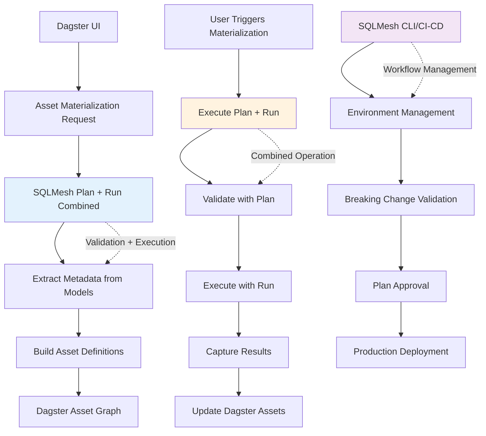

# ADR-0008: SQLMesh Plan/Run Flow and Separation of Concerns

## Status

**Accepted** - 2025-08-05

## Context

Our module integrates SQLMesh with Dagster for data materialization. We need to understand how SQLMesh's `plan` and `run` commands work, and establish clear boundaries between our tool's responsibilities and SQLMesh's native workflow management.

**Note**: While this ADR focuses on the plan/run flow and separation of concerns, the actual execution tracking and skip detection during the `run` phase is documented in [ADR-0016: SQLMesh Model Skip Detection and AssetCheck Integration](./0016-sqlmesh-model-skip-detection-assetcheck-integration.md).

## Decision

**Use SQLMesh `plan` for validation and `run` for materialization in a combined operation, with clear separation from SQLMesh's environment management and breaking change handling.**

## Rationale

### SQLMesh Native Workflow

SQLMesh has a two-phase approach:

1. **`sqlmesh plan`** - Analyzes changes, generates execution plan, validates breaking changes
2. **`sqlmesh run`** - Executes the plan, materializes data, applies changes

### Our Module's Role

Our module acts as a **materialization orchestrator**, not a **workflow manager**:

- ✅ **Materialize data** when needed
- ✅ **Report audit results** to Dagster
- ✅ **Extract metadata** from SQLMesh models directly
- ✅ **Validate execution** using SQLMesh plan
- ❌ **NOT manage environments** (dev/staging/prod)
- ❌ **NOT handle breaking changes**
- ❌ **NOT validate plans** (assumes plan is already validated)

## Implementation Flow

### 1. Combined Plan/Run Operation

```python
# Execute plan validation and materialization in one operation
def materialize_assets(sqlmesh_resource, selected_models):
    """Materialize assets using SQLMesh plan + run in combined operation."""

    model_names = [model.name for model in selected_models]

    # Generate plan for validation (doesn't apply changes)
    plan = sqlmesh_resource.context.plan(
        select_models=model_names,
        auto_apply=False,  # Never apply the plan, just validate
        no_prompts=True
    )

    # Execute run (applies the validated plan)
    sqlmesh_resource.context.run(
        environment=sqlmesh_resource.environment,
        select_models=model_names,
        execution_time=datetime.datetime.now(),
    )

    return plan  # Return plan for metadata extraction
```

### 2. Metadata Extraction from Models

```python
# Extract metadata directly from SQLMesh models (not from plan)
def extract_model_metadata(sqlmesh_resource, models):
    """Extract metadata directly from SQLMesh models for asset definition."""

    metadata = {}
    for model in models:
        asset_key = sqlmesh_resource.translator.get_asset_key(model)

        metadata[asset_key] = {
            "code_version": str(getattr(model, "data_hash", "")),
            "dependencies": sqlmesh_resource.translator.get_model_deps_with_external(
                sqlmesh_resource.context, model
            ),
            "tags": sqlmesh_resource.translator.get_tags(
                sqlmesh_resource.context, model
            ),
            "group_name": sqlmesh_resource.translator.get_group_name_with_fallback(
                sqlmesh_resource.context, model, "sqlmesh"
            )
        }

    return metadata
```

## Architecture Diagram



## Separation of Concerns

### Our Module Responsibilities

#### ✅ **What We Do**

1. **Metadata Extraction from Models**

   ```python
   # Extract metadata directly from SQLMesh models
   metadata = extract_model_metadata(sqlmesh_resource, models)
   ```

2. **Asset Definition Building**

   ```python
   # Build Dagster assets from SQLMesh model metadata
   assets = create_asset_specs_from_models(models, metadata)
   ```

3. **Combined Plan/Run Orchestration**

   ```python
   # Execute plan validation + run materialization
   plan = materialize_assets(sqlmesh_resource, selected_models)
   ```

4. **Audit Result Reporting**
   ```python
   # Report SQLMesh audits as Dagster asset checks
   check_results = convert_audits_to_checks(audit_results)
   ```

#### ❌ **What We DON'T Do**

1. **Environment Management**

   ```bash
   # NOT our responsibility
   sqlmesh plan --environment prod
   sqlmesh apply --environment staging
   ```

2. **Breaking Change Validation**

   ```bash
   # NOT our responsibility
   sqlmesh plan --validate-only
   sqlmesh plan --breaking-changes
   ```

3. **Plan Approval Workflow**

   ```bash
   # NOT our responsibility
   sqlmesh plan --auto-apply
   sqlmesh plan --require-approval
   ```

4. **Production Deployment**
   ```bash
   # NOT our responsibility
   sqlmesh apply --environment prod
   sqlmesh promote --environment prod
   ```

## Why Combined Plan/Run Works

### SQLMesh Plan Validation

The plan is used for **validation only**, not for metadata extraction:

```python
# Plan phase - validate execution (doesn't apply changes)
plan = context.plan(
    select_models=model_names,
    auto_apply=False,  # Never apply the plan
    no_prompts=True
)

# Run phase - execute the validated plan
context.run(
    environment=environment,
    select_models=model_names,
    execution_time=datetime.datetime.now(),
)
```

### Metadata Source

Metadata comes directly from SQLMesh models, not from the plan:

```python
# Extract metadata from models directly
for model in models:
    asset_key = translator.get_asset_key(model)
    code_version = str(getattr(model, "data_hash", ""))
    dependencies = translator.get_model_deps_with_external(context, model)
    tags = translator.get_tags(context, model)
```

### Validation Strategy

```python
def validate_execution_plan(plan, models):
    """Validate that plan is safe to execute."""

    if not plan:
        raise ValidationError("No plan generated")

    # Plan validation ensures safe execution
    # Metadata comes from models, not plan
    return True
```

## Production Scenarios

### Scenario 1: CI/CD Pipeline

```yaml
# .github/workflows/sqlmesh.yml
- name: SQLMesh Plan
  run: sqlmesh plan --environment prod

- name: SQLMesh Apply (if approved)
  run: sqlmesh apply --environment prod

- name: Dagster Materialization
  run: dagster asset materialize --select "sqlmesh_*"
```

**Our module's role**: Execute validated materialization, report audit results

### Scenario 2: Development Workflow

```bash
# Developer workflow
sqlmesh plan --environment dev
sqlmesh apply --environment dev

# Our module materializes when needed
dagster asset materialize --select "stg_customers"
```

**Our module's role**: Extract metadata from models, execute validated materialization

### Scenario 3: Breaking Changes

```bash
# SQLMesh handles breaking changes
sqlmesh plan --breaking-changes
# User reviews and approves

# Our module only materializes approved changes
dagster asset materialize --select "marts_*"
```

**Our module's role**: Execute materialization for validated changes only

## Consequences

### Positive

- ✅ **Clear boundaries** - No confusion about responsibilities
- ✅ **Leverage SQLMesh expertise** - Use native workflow management
- ✅ **Efficient execution** - Plan validation + run execution in one operation
- ✅ **Production ready** - Works with existing SQLMesh CI/CD
- ✅ **Audit integration** - SQLMesh audits become Dagster checks
- ✅ **Performance optimization** - Only materialize when needed

### Negative

- ⚠️ **Dependency on SQLMesh CLI** - Requires proper SQLMesh setup
- ⚠️ **Model metadata extraction** - Need to extract from SQLMesh models
- ⚠️ **Plan validation dependency** - Must ensure plan is valid before run
- ⚠️ **Error handling** - Handle SQLMesh plan/run failures gracefully

## Edge Cases

### Plan Generation Fails

```python
try:
    plan = context.plan(select_models=model_names, auto_apply=False)
except PlanError as e:
    # Handle gracefully - plan validation failed
    logger.warning(f"Plan validation failed: {e}")
    raise DagsterExecutionError(f"SQLMesh plan validation failed: {e}")
```

### Run Execution Fails

```python
try:
    context.run(environment=environment, select_models=model_names)
except RunError as e:
    # Report failure to Dagster
    raise DagsterExecutionError(f"SQLMesh run failed: {e}")
```

### Model Metadata Extraction Fails

```python
try:
    metadata = extract_model_metadata(sqlmesh_resource, models)
except Exception as e:
    # Handle gracefully - metadata extraction failed
    logger.warning(f"Model metadata extraction failed: {e}")
    return fallback_metadata()
```

## Related Decisions

- [ADR-0002: Shared SQLMesh Execution](./0002-shared-sqlmesh-execution.md)
- [ADR-0003: Asset Check Integration](./0003-asset-check-integration.md)
- [ADR-0007: Code Version and Data Version Mapping](./0007-code-version-data-version-mapping.md)
- [ADR-0016: SQLMesh Model Skip Detection and AssetCheck Integration](./0016-sqlmesh-model-skip-detection-assetcheck-integration.md)
