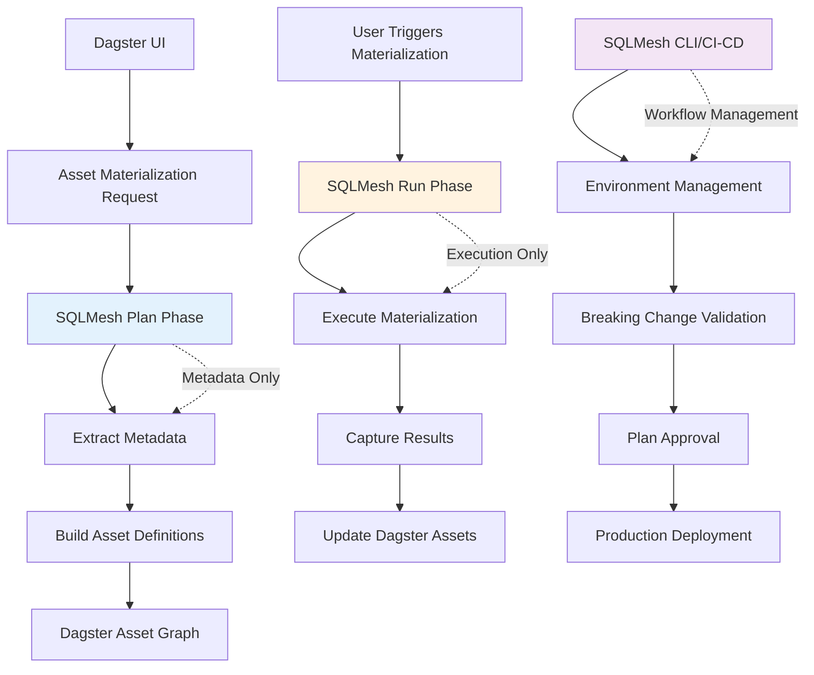

# ADR-0008: SQLMesh Plan/Run Flow and Separation of Concerns

## Status

**Accepted** - 2025-08-05

## Context

Our module integrates SQLMesh with Dagster for data materialization. We need to understand how SQLMesh's `plan` and `run` commands work, and establish clear boundaries between our tool's responsibilities and SQLMesh's native workflow management.

## Decision

**Use SQLMesh `plan` for metadata extraction and `run` for materialization, with clear separation from SQLMesh's environment management and breaking change handling.**

## Rationale

### SQLMesh Native Workflow

SQLMesh has a two-phase approach:

1. **`sqlmesh plan`** - Analyzes changes, generates execution plan, validates breaking changes
2. **`sqlmesh run`** - Executes the plan, materializes data, applies changes

### Our Module's Role

Our module acts as a **materialization orchestrator**, not a **workflow manager**:

- ✅ **Materialize data** when needed
- ✅ **Report audit results** to Dagster
- ✅ **Extract metadata** from SQLMesh plans
- ❌ **NOT manage environments** (dev/staging/prod)
- ❌ **NOT handle breaking changes**
- ❌ **NOT validate plans**

## Implementation Flow

### 1. Metadata Extraction (Plan Phase)

```python
# Extract metadata from SQLMesh plan without applying it
def extract_plan_metadata(sqlmesh_resource, selected_models):
    """Extract metadata from SQLMesh plan for asset definition."""
    
    # Generate plan (doesn't apply changes)
    plan = sqlmesh_resource.context.plan(
        models=selected_models,
        environment=sqlmesh_resource.environment
    )
    
    # Extract metadata from plan
    metadata = {
        "snapshot_versions": {},
        "partition_info": {},
        "model_dependencies": {},
        "audit_specs": {}
    }
    
    for snapshot in plan.snapshots.values():
        model = snapshot.model
        asset_key = sqlmesh_resource.translator.get_asset_key(model)
        
        metadata["snapshot_versions"][asset_key] = snapshot.version
        metadata["partition_info"][asset_key] = get_partition_info(snapshot)
        metadata["model_dependencies"][asset_key] = get_dependencies(snapshot)
        metadata["audit_specs"][asset_key] = get_audit_specs(model)
    
    return metadata
```

### 2. Materialization (Run Phase)

```python
# Execute materialization using SQLMesh run
def materialize_assets(sqlmesh_resource, selected_models):
    """Materialize assets using SQLMesh run command."""
    
    # Execute run (applies the plan)
    results = sqlmesh_resource.context.run(
        models=selected_models,
        environment=sqlmesh_resource.environment
    )
    
    # Extract results for Dagster
    materialization_results = []
    for snapshot in results.snapshots.values():
        asset_key = sqlmesh_resource.translator.get_asset_key(snapshot.model)
        
        materialization_results.append(MaterializeResult(
            asset_key=asset_key,
            data_version=DataVersion(str(snapshot.version)),
            metadata={
                "rows_processed": snapshot.rows_processed,
                "execution_time": snapshot.execution_time,
                "status": "success"
            }
        ))
    
    return materialization_results
```

## Architecture Diagram



## Separation of Concerns

### Our Module Responsibilities

#### ✅ **What We Do**

1. **Metadata Extraction**
   ```python
   # Extract from plan without applying
   plan = context.plan(models=selected_models)
   metadata = extract_plan_metadata(plan)
   ```

2. **Asset Definition Building**
   ```python
   # Build Dagster assets from SQLMesh metadata
   assets = create_asset_specs_from_metadata(metadata)
   ```

3. **Materialization Orchestration**
   ```python
   # Execute materialization when needed
   results = context.run(models=selected_models)
   ```

4. **Audit Result Reporting**
   ```python
   # Report SQLMesh audits as Dagster asset checks
   check_results = convert_audits_to_checks(audit_results)
   ```

#### ❌ **What We DON'T Do**

1. **Environment Management**
   ```bash
   # NOT our responsibility
   sqlmesh plan --environment prod
   sqlmesh apply --environment staging
   ```

2. **Breaking Change Validation**
   ```bash
   # NOT our responsibility
   sqlmesh plan --validate-only
   sqlmesh plan --breaking-changes
   ```

3. **Plan Approval Workflow**
   ```bash
   # NOT our responsibility
   sqlmesh plan --auto-apply
   sqlmesh plan --require-approval
   ```

4. **Production Deployment**
   ```bash
   # NOT our responsibility
   sqlmesh apply --environment prod
   sqlmesh promote --environment prod
   ```

## Why Plan Metadata is Valid for Run

### SQLMesh Plan Consistency

The metadata extracted from `sqlmesh plan` is **identical** to what would be used in `sqlmesh run`:

```python
# Plan phase - extract metadata
plan = context.plan(models=["model_a", "model_b"])
plan_metadata = {
    "model_a": {"version": "v1.2.3", "partitions": {...}},
    "model_b": {"version": "v1.2.4", "partitions": {...}}
}

# Run phase - same metadata structure
run = context.run(models=["model_a", "model_b"])
run_metadata = {
    "model_a": {"version": "v1.2.3", "partitions": {...}},  # ← Identical
    "model_b": {"version": "v1.2.4", "partitions": {...}}   # ← Identical
}
```

### Validation Strategy

```python
def validate_plan_run_consistency(plan_metadata, run_metadata):
    """Ensure plan and run metadata are consistent."""
    
    for model_name in plan_metadata:
        plan_version = plan_metadata[model_name]["version"]
        run_version = run_metadata[model_name]["version"]
        
        if plan_version != run_version:
            raise InconsistencyError(
                f"Plan and run versions differ for {model_name}: "
                f"plan={plan_version}, run={run_version}"
            )
```

## Production Scenarios

### Scenario 1: CI/CD Pipeline

```yaml
# .github/workflows/sqlmesh.yml
- name: SQLMesh Plan
  run: sqlmesh plan --environment prod
  
- name: SQLMesh Apply (if approved)
  run: sqlmesh apply --environment prod
  
- name: Dagster Materialization
  run: dagster asset materialize --select "sqlmesh_*"
```

**Our module's role**: Only materialize data, report audit results

### Scenario 2: Development Workflow

```bash
# Developer workflow
sqlmesh plan --environment dev
sqlmesh apply --environment dev

# Our module materializes when needed
dagster asset materialize --select "stg_customers"
```

**Our module's role**: Extract metadata, materialize on demand

### Scenario 3: Breaking Changes

```bash
# SQLMesh handles breaking changes
sqlmesh plan --breaking-changes
# User reviews and approves

# Our module only materializes approved changes
dagster asset materialize --select "marts_*"
```

**Our module's role**: No involvement in breaking change validation

## Consequences

### Positive

- ✅ **Clear boundaries** - No confusion about responsibilities
- ✅ **Leverage SQLMesh expertise** - Use native workflow management
- ✅ **Consistent metadata** - Plan and run metadata are identical
- ✅ **Production ready** - Works with existing SQLMesh CI/CD
- ✅ **Audit integration** - SQLMesh audits become Dagster checks
- ✅ **Performance optimization** - Only materialize when needed

### Negative

- ⚠️ **Dependency on SQLMesh CLI** - Requires proper SQLMesh setup
- ⚠️ **Metadata extraction complexity** - Need to parse SQLMesh plans
- ⚠️ **Version consistency** - Must ensure plan/run metadata match
- ⚠️ **Error handling** - Handle SQLMesh plan/run failures gracefully

## Edge Cases

### Plan Generation Fails

```python
try:
    plan = context.plan(models=selected_models)
except PlanError as e:
    # Handle gracefully - maybe use cached metadata
    logger.warning(f"Plan generation failed: {e}")
    return fallback_metadata()
```

### Run Execution Fails

```python
try:
    results = context.run(models=selected_models)
except RunError as e:
    # Report failure to Dagster
    raise DagsterExecutionError(f"SQLMesh run failed: {e}")
```

### Metadata Inconsistency

```python
# Validate plan/run consistency
if plan_metadata != run_metadata:
    raise InconsistencyError("Plan and run metadata differ")
```

## Related Decisions

- [ADR-0002: Shared SQLMesh Execution](./0002-shared-sqlmesh-execution.md)
- [ADR-0003: Asset Check Integration](./0003-asset-check-integration.md)
- [ADR-0007: Code Version and Data Version Mapping](./0007-code-version-data-version-mapping.md) 