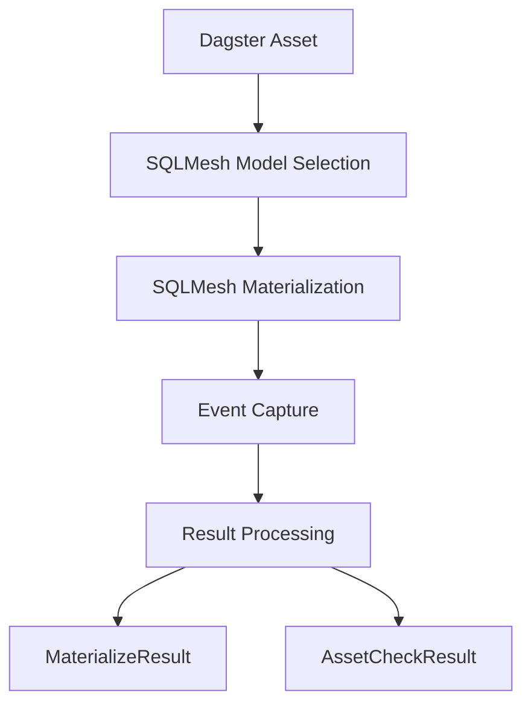

# Core Concepts

This page explains the fundamental concepts behind dg-sqlmesh and how it integrates SQLMesh with Dagster.

## Overview

dg-sqlmesh bridges two powerful data engineering tools:

- **SQLMesh**: A data modeling and transformation framework
- **Dagster**: A data orchestration and workflow management platform

## Key Concepts

### 1. Individual Asset Pattern

Each SQLMesh model becomes a separate Dagster asset that:

- **Materializes independently** : Each asset can succeed or fail on its own
- **Controls execution** : Individual success/failure tracking
- **Manages dependencies** : Proper dependency mapping between models
- **Handles checks** : Audit results as AssetCheckResult outputs

### 2. Shared Execution Model

While each asset is independent, they share execution context:

- **Single SQLMesh run** : One `sqlmesh run` per Dagster run
- **Shared results** : Assets reuse captured results via `SQLMeshResultsResource`
- **Optimized performance** : SQLMesh automatically skips models that don't need materialization

### 3. Console Architecture

The system uses custom SQLMesh consoles to:

- **Capture events** : Materialization results, audit outcomes, errors
- **Process metadata** : Extract and format information for Dagster
- **Handle errors** : Proper error categorization and reporting

## Architecture Components

### SQLMeshResource

- **Manages SQLMesh context** : Connection, caching, configuration
- **Implements singleton pattern** : Ensures single instance per project
- **Handles multithreading** : Uses AnyIO for non-blocking operations
- **Accepts custom translators** : Extensible mapping system

### SQLMeshTranslator

- **Maps SQLMesh to Dagster** : Asset keys, metadata, dependencies
- **Extensible via inheritance** : Override methods for custom behavior
- **Handles external assets** : Source mapping and dependency resolution
- **Manages tags and groups** : Dagster property mapping

### Factory Functions

- **sqlmesh_definitions_factory** : All-in-one configuration
- **sqlmesh_assets_factory** : Asset creation only
- **sqlmesh_adaptive_schedule_factory** : Schedule and job creation

## Data Flow

## Next Steps

- **[SQLMesh Integration](sqlmesh-integration.md)** - Learn about SQLMesh-specific features
- **[Asset Management](asset-management.md)** - Understand asset lifecycle
- **[Examples](../examples/basic-usage.md)** - See concepts in action
